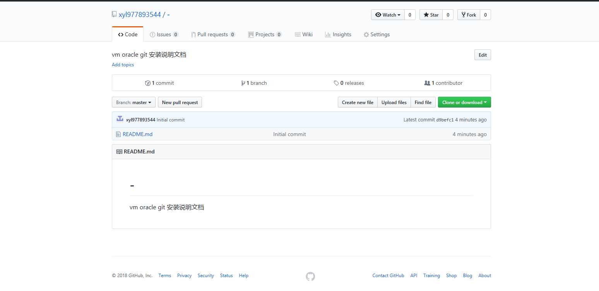
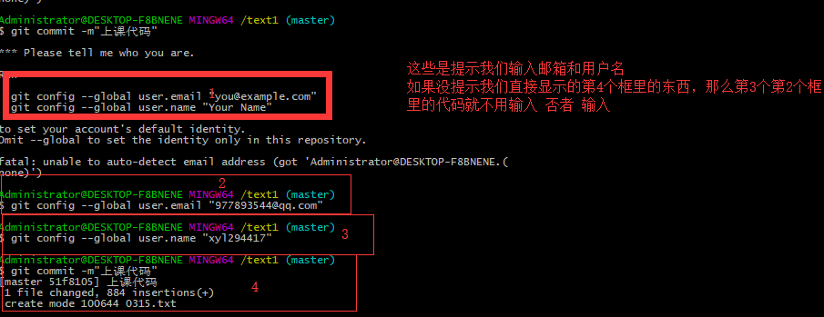
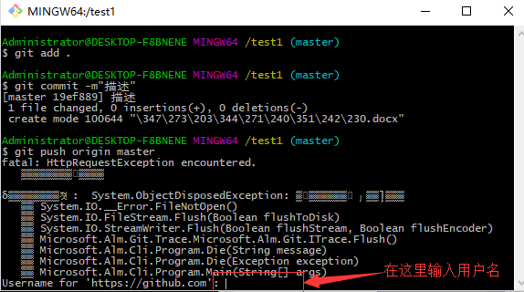
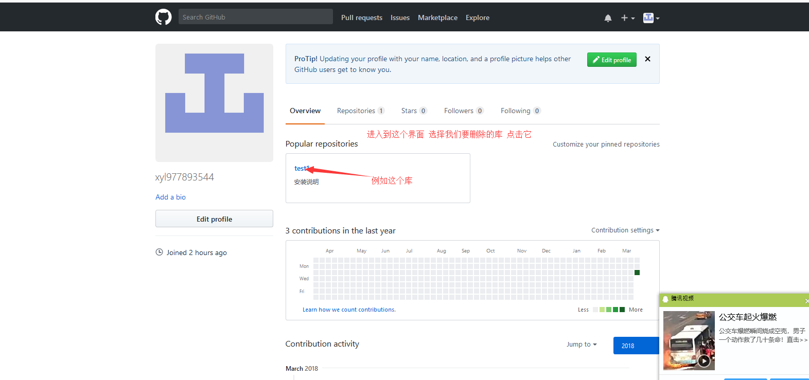
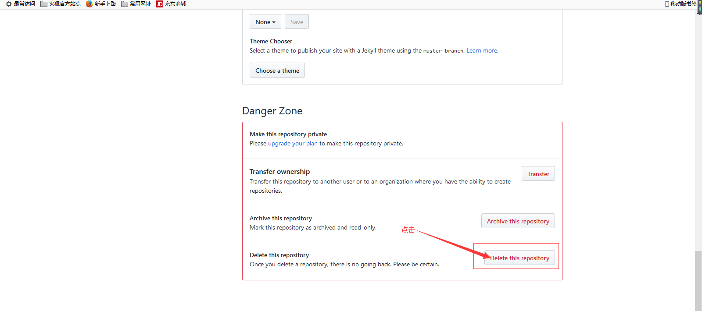

网址：https://github.com/
=
一、注册账户：
=
---------
1、
=
-------

2、
=
-------

3、
=
-------

4、
=
-------

5、
=
-------

6、
=
-------

7、
=
-------

8、
=
-------

9、
=
-------

二、安装git-2.12.1-64-bit工具
=
------
1、
=
-------

2、
=
-------

3、
=
-------

4、
=
-------

5、
=
-------

6、
=
-------

7、
=
-------

8、
=
-------

9、
=
-------

三、使用git工具进行库的下载和文件的上传
=
--------
1、
=
-------
找到我们安装git 的目录文件夹下：
==
如图：
==

2、
=
-------
在这个文件夹里 鼠标右击——然后选择git bash here
=

3、
=
-------
点击 git bash here 后会弹出 ：
=

4、
=
-------
登陆我们注册的账户 然后点击your profile 如图：
=

5、
=
-------

6、
=
-------

7、
=
-------

8、
=
-------
下载库
==
在第3步 弹出的窗口里输入：
==
句式：git clone空格+网址（这个网址是第7步复制的那个网址）如图：
=
例子：git clone https://github.com/xyl977893544/test1.git
==

9、
=
-------
关闭这个上面这个窗口 将我们要上传的文件复制到库文件夹里 然后在这个文件里面右击 选择 git bash here
=

在这个库文件夹里右击 选择 git bash here
=

弹出这个窗口：
=

10、
=
-------
git 空格add空格.(空格后面有个点)
==
 在弹出的窗口里 输入： git add .
=

11、
=
-------
git空格commit空格-m”描述”
==
上图完成后 输入 git commit -m””
==
例子：git commit -m”上课代码”
==

图一：
==
git config --global user.email “注册时的邮箱”
==
git config --global user.name “注册时的名字”
==

图二：
==
如果直接显示这个图  可以直接进行下一步
=
-------

12、
=
-------
输入：git push origin master
=
等一会 再最下面一行输入用户名
=
如图：
=

13、输入密码：
=
-------
输入用户名后 回车会让你输入密码
=
如图：
=

14、
==
----

四、对我们已经建好的库进行删除的方法：
==
-----
1、

2、
=
-------

3、
=
-------

4、
=
-------
点击 setting 后往下滑  找到如图所示：
=

5、
=
-------

6、
=
-------

7、
=
-------

