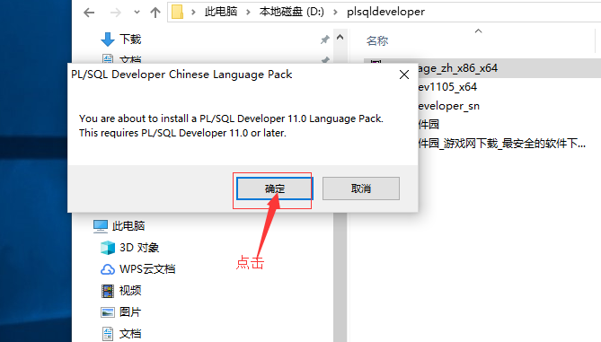

PLSQ安装-配置文档
=
----
##1、

##2、
###输入natca

##3、

##4、

##5、

##6、

##7、

##8、

##9、

##10、

##11、

##12、

##13、

##14、

##15、

##16、

##17、

##18、

##19、

##20、

##21、

##22、

##23、

##24、

##25、

##26、

##27、

##28、

##29、

##30、

##31、

##32、

##33、

##34、

##35、

##36、

##37、

##38、

##39、

##40、

##41、

##42、

##43、

##44、

##45、

##46、

##47、

##48、

##49、
