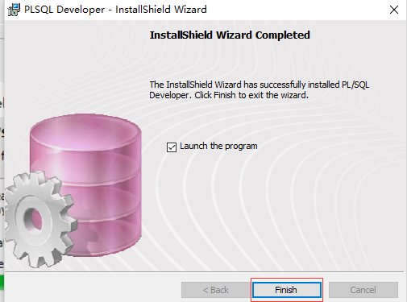

PLSQ安装-配置文档
=
----
1、
=
---------
 
2、
=
------
输入natca
=
 
3、
=
----------
 
4、
=
----------
 
5、
=
-----------
 
6、
=
-------------
 
7、
=
--------------
 
8、
=
---------------
 
9、
=
----------------
 
10、
=
-------------
 
11、
=
--------------
 
12、
=
-------------
 
13、
=
-------------
 
14、
=
-------
 
15、
=
---------
 
16、
=
--------------
 
17、
=
------------
 
18、
=
--------------
 
19、
=
----------------
 
20、
=
---------------
 
21、
=
---------------
 
22、
=
-------------
 
23、
=
-------------
 
24、
=
-------------
 
25、
=
--------------
 
26、
=
------------
 
27、
=
-------------
 
28、
=
-------------
 
29、
=
-----------
 
30、
=
------------
 
31、
=
----------
 
32、
=
------------
 
33、
=
-------------
 
34、
=
-------------
 
35、
=
--------------
 
36、
=
-------------
 
37、
=
------------
 
38、
=
---------------
 
39、
=
--------------
 
40、
=
---------------
 
41、
=
--------------
 
42、
=
-------------
 
43、
=
--------------
 
44、
=
-------------
 
45、
=
------------
 
46、
=
--------------
 
47、
=
------------
 
48、
=
----------------
 
49、
=
--------------
 