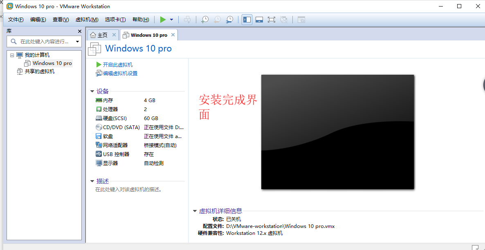
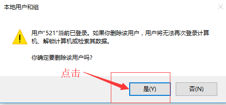

vm虚拟机安装说明：
=
------
1、
=
-----
 
2、
=
-----
 
3、
=
------
选择Windows powershell（管理员）
=
 
4、
=
------
 
5、
=
-----
 
6、
=
-----
 
7、
=
------
 
8、
=
----
 
9、
=
-----
 
10、
=
------
 
11、
=
------
 
12、
=
-------
 
13、
=
-----------
 
14、
=
-------
 
15、
=
----------
 
16、
=
------
 
17、
=
-----
 
18、
=
----
 
19、
=
---------
 
20、
=
-------
 
21、
=
----------
 
22、
=
---------
 
23、
=
-------
 
24、
=
-------
 
25、
=
-------
 
26、
=
-----------
 
27、
=
-----------
 
28、
=
-------------
 
29、
=
-----------
 
30、
=
----------
 
31、
=
-------------
 
32、
=
-------------
 
33、
=
-------------
 
34、
=
-------------
 
35、
=
--------
 
36、
=
-------------
 
37、
=
------------
 
38、
=
------------
 
39、
=
------------
 
40、
=
---------------
 
41、
=
--------------
 
42、
=
-------------
 
43、
=
------------
 
44、
=
------------
 
45、
=
-------------
 
46、
=
----------------
 
 
47、
=
-------------
 
48、
=
--------------
 
 
49、
=
-------------
 
50、
=
-------------
 
51、
=
------------
 
52、
=
-----------
 
53、
=
---------------
 
54、
=
--------------
 
55、
=
--------------
 
56、
=
--------------
 
57、
=
-------------
 
58、
=
-------------
 
59、
=
--------------
 
60、
=
--------------
 
61、
=
------------
 
62、
=
------------
 
63、
=
-------------
 
64、
=
-------------
 
65、
=
-------------
 
66、
=
-------------
 
67、
=
-------------
 
68、
=
-------------
 
69、
=
-------------
 
70、
=
-------------
 
71、
=
--------
 
72、
=
------------
 
73、
=
-------------
 
74、
=
---------------
 
75、
=
---------------
 
76、
=
--------------
 
77、
=
-----------
 
78、
=
----------
 
79、
=
-----------
点击虚拟机选择设置：
=
 
80、
=
--------------
 
81、
=
-----------
 
82、
=
-------------
 
83、
=
--------------
 
84、
=
-------------
 
85、
=
-----------
右击选择控制及面板
=
 
86、
=
------------
 
87、
=
------------
 
88、
=
-------------
 
89、
=
-------------
 
90、
=
-------------
右击选择计算机管理
=
 
91、
=
------------
 
92、
=
---------------
 
93、
=
--------------
 
94、
=
--------------
在桌面alt+f4 然后选择切换用户
=
 
95、
=
--------------
 
96、
=
-----------
右击选择控制面板
=
 
97、
=
------------
 
98、
=
------------
 
99、
=
--------------
 
100、
=
--------------
 
101、
=
------------
右击选择计算机管理
=
 
102、
=
------------
 
103、
=
-----------
 
104、
=
-------------
 
105、
=
--------------
 
106、
=
---------
 
107、
=
---------------
 

